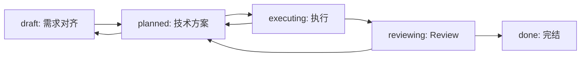

# SDD Lab

## 核心定位

- `sdd-lab` 是面向需求迭代的 SDD 工作流，不是单文件 micro-spec。
- 核心目标是拆分并固化三类核心文档：`requirements.md` 记录“要做什么和为什么”，`visual-design.md` 记录“Figma 设计稿是什么样”，`technical-plan.md` 记录“基于当前项目怎么做”。
- `lifecycle.md` 只负责状态、批准、执行记录、验证证据、review 结论和恢复锚点。
- 默认中文、短输出、先对齐再推进；不要把聊天内容直接堆进文档。

## 硬约束

- `Spec is Truth`：文档是需求迭代的真相源；文档与代码冲突时，先判断并修正文档，再修代码。
- `No Spec, No Code`：没有需求文档和技术方案，不进入代码实现；若涉及视觉稿，还必须先有必要的视觉设计文档。
- `No Approval, No Execute`：没有用户明确批准，不进入执行阶段或高影响变更。
- `Restate First`：用户提出任务后，先复述理解，再判断关联迭代。
- `Requirement Before Plan`：先完成需求对齐，再生成技术方案。
- `Visual Before Plan`：若需求涉及 Figma、视觉稿、页面还原、Icon 导出或设计稿文档化，先生成或更新 `visual-design.md`，再生成技术方案。
- `Plan Before Execute`：先基于项目现状生成技术方案，再请求执行批准。
- `Reverse Sync`：执行、验证、review 后必须回写 `lifecycle.md`；若需求或方案变化，先回写对应文档。
- `Resume Ready`：暂停或收尾前留下下一步唯一动作，方便继续。

## 文档根目录

- 根目录：`docs/sdd-lab/`
- 每个需求迭代一个独立文件夹：`docs/sdd-lab/YYYY-MM-DD_hh-mm_<iteration-name>/`
- 阶段文件：
  - `lifecycle.md`
  - `requirements.md`
  - `visual-design.md`：仅在需求涉及 Figma、视觉稿、页面还原、Icon 导出或设计稿文档化时创建；不要创建空占位文件。
  - `technical-plan.md`：仅在技术方案生成阶段创建；需求文档生成阶段不要创建占位文件。

详细结构与模板按需读取：

- `references/document-structure.md`
- `references/templates.md`

`references/*` 是 `sdd-lab` 的内部资料，仅在当前任务已激活 `sdd-lab` 且处理 `docs/sdd-lab/` 迭代文档时生效；不得外溢到其他 skill 或后续无关任务。

## 默认行为

当用户没有输入具体任务，或只说“用 sdd-lab”“继续 sdd-lab”“列一下需求”等泛化请求时：

1. 读取 `docs/sdd-lab/` 下已有迭代。
2. 按 `进行中优先 + 时间倒序` 列出当前需求列表。
3. `进行中` 和 `已完结` 都是虚拟分组：`draft`、`planned`、`executing` 属于进行中；`reviewing`、`done` 属于已完结。
4. 输出每个迭代的名称、状态、最近更新时间、下一步动作。
5. 不擅自创建新迭代，不进入代码实现。

当用户有额外说明时：

1. 先复述理解。
2. 先判断是否能关联已有迭代。
3. 如果不明确，询问用户选择已有迭代或创建新迭代。
4. 创建新迭代前，先确认名称、目标和初始需求摘要。

## 状态模型

状态只保留 5 个：

- `draft`：需求对齐中，主要维护 `requirements.md`。
- `planned`：需求已确认，视觉设计文档按需补齐，技术方案生成或已确认，主要维护 `visual-design.md`（如涉及视觉稿）和 `technical-plan.md`。
- `executing`：用户已批准执行，进入代码或配置修改。
- `reviewing`：实现完成后，对照需求文档和技术方案检查；列表展示时算已完结。
- `done`：已完结。完成、取消、拒绝等差异写入 `result`，不扩展为多个终态。

状态流转：

回退规则：

- `planned -> draft`：技术方案阶段发现需求不清或需求变更。
- `executing -> planned`：执行中发现技术方案不可行。
- `reviewing -> planned`：review 发现方案偏差、实现风险或验证不足。

## 生命周期工作流

### 1. 需求文档生成阶段

- 目标：对齐需求，而不是设计实现。
- 只创建或更新 `requirements.md` 和必要的 `lifecycle.md`。
- 不创建 `technical-plan.md`，占位文件也不需要。
- 记录目标、背景、范围、非目标、验收标准、开放问题。
- 用户确认需求边界后，状态可从 `draft` 进入 `planned`。

### 2. 视觉设计文档生成阶段

- 目标：把 Figma 或视觉设计稿转写为稳定、可审阅、可实现的设计事实。
- 仅当需求涉及 Figma、视觉稿、页面还原、Icon 导出或设计稿文档化时创建或更新 `visual-design.md`；不涉及视觉稿时跳过本阶段。
- `visual-design.md` 至少包含 `来源`、`页面设计`、`Icon / SVG 组件导出` 三个章节。
- `来源` 只记录核心追溯信息，例如 Figma 链接、文件名、Frame / Node、版本或更新时间。
- `页面设计` 内部结构由视觉稿内容决定，只记录稿中真实存在且对实现或验收有用的设计事实。
- `Icon / SVG 组件导出` 记录需要导出的 Icon、命名、尺寸、颜色策略、组件路径和导出状态。
- 视觉稿疑问就近记录在相关章节；影响需求或技术决策的问题同步到 `requirements.md` 或 `technical-plan.md`。
- 不把实现方案写进 `visual-design.md`；实现映射和代码落点写入 `technical-plan.md`。

### 3. 技术方案生成阶段

- 目标：基于项目现状和已确认需求生成技术方案。
- 若需求涉及 Figma 或视觉稿，必须先读取并维护 `visual-design.md`，再基于需求、视觉设计文档、相关代码、接口和约束创建或更新 `technical-plan.md`。
- 记录涉及模块、数据流、接口变化、执行步骤、风险、验证方式。
- `Open Questions` 由 Agent 负责发现、归纳、补充事实和提出候选处理方式，但问题回答与关闭必须由用户确认。
- 方案决策由用户负责；Agent 只能提出方案对比、推荐方案和依据，不能替用户拍板。
- 技术方案确认后，给执行 checkpoint，等待用户批准。

### 4. 执行阶段

- 前置条件：`requirements.md` 已确认，`technical-plan.md` 已形成，`lifecycle.md` 中批准状态明确。
- 执行中若发现需求或方案错误，暂停实现，先回写文档并回退状态。
- 执行后记录变更摘要和验证证据。

### 5. Review 阶段

- 按 `requirements.md` 检查是否满足需求。
- 若存在 `visual-design.md`，按视觉设计文档检查页面还原、视觉约束和 Icon SVG 组件导出要求。
- 按 `technical-plan.md` 检查实现是否偏离方案。
- 结论回写 `lifecycle.md`。
- 发现 Bug 或偏差时，遵循 `Reverse Sync`：先修文档，再修代码。

## 输出风格

- 默认中文，短输出。
- 优先输出：当前理解、关联迭代、当前状态、下一步、是否需要用户确认。
- 不机械展开完整协议；只在需要时读取 reference。
- 每次状态变化都说明“从什么状态到什么状态、依据是什么、下一步是什么”。
