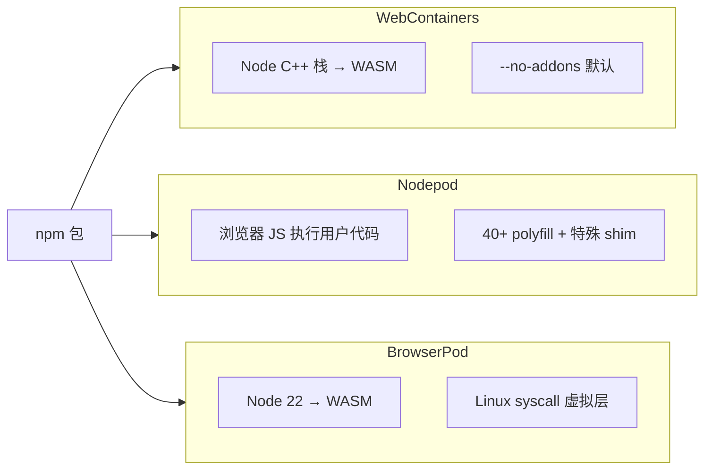

# 浏览器内 Node 运行时兼容性报告

## WebContainers · Nodepod · BrowserPod

> **文档性质**：基于各产品公开文档、发布说明与行业资料的对比报告；**不绑定**本仓库实现，未对三者在同一基准套件下做同机复测。  
> **对比对象**：StackBlitz **WebContainers**（`@webcontainer/api`）、Scelar **Nodepod**（`@scelar/nodepod`）、Leaning Technologies **BrowserPod**（`@leaningtech/browserpod`）。  
> **信息截止**：2026 年 5 月。  
> **评级说明**：`●` 高 / `◐` 中 / `○` 低 / `✗` 不支持或官方明确受限；「中」表示需 shim、override 或场景验证。

---

## 目录

1. [执行摘要](#1-执行摘要)
2. [实现模型与兼容性逻辑](#2-实现模型与兼容性逻辑)
3. [总览对比矩阵](#3-总览对比矩阵)
4. [Node.js 内置 API](#4-nodejs-内置-api)
5. [npm 包与原生依赖](#5-npm-包与原生依赖)
6. [框架与工具链](#6-框架与工具链)
7. [Shell、进程与终端](#7-shell进程与终端)
8. [文件系统与持久化](#8-文件系统与持久化)
9. [网络、预览与出站访问](#9网络预览与出站访问)
10. [浏览器与部署约束](#10-浏览器与部署约束)
11. [安全与不可信代码](#11-安全与不可信代码)
12. [许可与运维](#12-许可与运维)
13. [选型速查](#13-选型速查)
14. [验证建议（POC 清单）](#14-验证建议poc-清单)
15. [参考资料](#15-参考资料)

---

## 1. 执行摘要

三者都在**浏览器标签页**内提供「类 Node 开发环境」，但**兼容性来源完全不同**，不能仅用「Node 版本号」横向对比。

| 运行时 | npm 包 | 实现本质 | 官方兼容叙事 | 典型强项 | 典型短板 |
|--------|--------|----------|--------------|----------|----------|
| **WebContainers** | `@webcontainer/api` | Node 栈 **WASM 化** + StackBlitz 基础设施 | 业界成熟，宣称 ~95% 场景 | Next/Nuxt、Vite 生态、StackBlitz 同源 | 商业 API、体积/冷启动、依赖 StackBlitz 代理 |
| **Nodepod** | `@scelar/nodepod` | **TS polyfill** + 浏览器 JS 引擎 + 特殊 shim | 场景驱动，40+ 内置模块完整实现 | 启动快、开源、可 fork | 边缘 Node 语义、原生 Next（webpack）弱 |
| **BrowserPod** | `@leaningtech/browserpod` | **真实 Node 22** 编译 WASM + 类 Linux syscall | 「未改动的 Node 项目」 | 高保真 Node、Portals、面向不可信代码 | 专有许可、原生二进制需 override、API 层 shell 弱 |

**共性硬约束（三者高度重叠）**：

- **原生 `.node` addon / 平台二进制** 普遍不可用或需替换为 JS/WASM 版本。  
- **`SharedArrayBuffer` → 需要 COOP/COEP**（生产 HTTPS）。  
- **仅 Chromium 系最稳**；Safari/Firefox 支持程度不一。  
- **标签页内存与休眠** 限制大 monorepo 与长驻任务。

**一句话选型**：

- 要 **最高前端框架覆盖 + 商业可接受** → 优先评估 **WebContainers**。  
- 要 **开源、轻量、可控、AI 预览** → 优先评估 **Nodepod**。  
- 要 **最接近真 Node 22 + Agent 沙箱叙事 + Portals** → 优先评估 **BrowserPod**（接受专有许可与 API Key）。

---

## 2. 实现模型与兼容性逻辑

理解「为什么同一 npm 包在 A 能跑、在 B 不能跑」，比背功能表更重要。



| 维度 | WebContainers | Nodepod | BrowserPod |
|------|---------------|---------|------------|
| **用户 JS 执行** | WASM 内 Node/V8 路径 | 主线程/Worker 内 `eval` + 沙箱 globals | WASM Node 22 |
| **内置 `node:*`** | 真 Node 内置（WASM） | 自研 polyfill / stub | 真 Node 内置（WASM） |
| **同步 `readFileSync`** | 真同步（WASM 线程模型） | `SyncPromise` / SAB 等模拟 | 真同步（近原生） |
| **第三方包兼容** | 依赖 Node 行为 + 禁 addon | 依赖 polyfill 覆盖度 + shim | 依赖 WASM Node + 二进制替换 |
| **「特殊 shim」** | 较少（运行时侧处理） | **显式**替换 `chokidar`/`esbuild`/`rollup`/`ws` 等 | **package.json overrides** 换 WASM 版工具链 |

因此：

- **纯 JS 包**：三者通常都较好。  
- **依赖 Node 内部 API / 微妙时序**：BrowserPod ≈ WebContainers > Nodepod。  
- **依赖原生二进制（esbuild 默认 postinstall 等）**：三者都要 **WASM 替代或内置 shim**；策略不同。  
- **依赖完整 bash / 系统命令**：BrowserCode 演示有 bash；BrowserPod **`pod.run` 不是 shell**；Nodepod 为自研子集；WebContainers 为 WASM 环境。

---

## 3. 总览对比矩阵

| 类别 | WebContainers | Nodepod | BrowserPod |
|------|:-------------:|:-------:|:----------:|
| **整体 Node API 保真** | ● | ◐ | ● |
| **npm 安装与解析** | ● | ◐ | ● |
| **原生 addon（sharp 等）** | ✗ | ✗ | ✗ |
| **Vite / 现代前端 dev** | ● | ◐ | ◐ |
| **Next.js 原生（webpack）** | ● | ✗ | ◐ |
| **Next.js（App Router / 新方案）** | ● | ◐ | ◐ |
| **Express / 小型 HTTP** | ● | ● | ● |
| **交互式 CLI（create-*）** | ● | ◐ | ◐ |
| **完整 bash** | ◐ | ◐ | ◐ |
| **多进程 / child_process** | ● | ◐ | ● |
| **预览 / 本地服务暴露** | ● | ◐ | ● |
| **不可信代码隔离** | ◐ | ○ | ● |
| **开源可审计** | ○ | ● | ○ |
| **零后端 / 纯浏览器** | ●* | ● | ● |
| **商业集成成本** | ○ | ● | ◐ |

\* WebContainers API 依赖 StackBlitz **托管代理与加速**（npm 条款），非完全「零厂商基础设施」。

---

## 4. Node.js 内置 API

### 4.1 内置模块覆盖（定性）

| 模块族 | WebContainers | Nodepod | BrowserPod |
|--------|---------------|---------|------------|
| `fs` / `path` | ● | ●（内存 VFS） | ●（POSIX 流式 VFS） |
| `http` / `https` | ● | ●（虚拟 server + SW） | ● |
| `stream` / `buffer` / `events` | ● | ● | ● |
| `child_process` | ● | ◐（Worker + SAB 模拟） | ● |
| `worker_threads` | ◐ | ◐（stub/部分） | ◐ |
| `net` / `tls` | ◐ | ◐ / ✗（tls 抛错） | ◐ |
| `crypto`（哈希/HMAC/随机） | ● | ●（Web Crypto） | ● |
| `crypto`（对称 `createCipheriv`） | ◐ | ✗ | ◐ |
| `cluster` / `dgram` / `http2` | ◐ | ✗ 或 stub | ◐ |
| `vm` / `v8` / `inspector` | ◐ | stub | ◐ |

### 4.2 Nodepod 官方模块分级（摘录）

| 分级 | 模块（节选） |
|------|----------------|
| **完整实现** | `fs`, `path`, `events`, `stream`, `buffer`, `process`, `http`, `https`, `net`, `crypto`, `zlib`, `url`, `util`, `os`, `child_process`, `readline`, `module`, `timers`, … |
| **桩/简化** | `dns`, `worker_threads`, `vm`, `tls`, `cluster`, `http2`, `async_hooks`, … |
| **开发中** | napi-rs 类包的 **WASI/WASM 加载**（rolldown、lightningcss 等） |

### 4.3 语义差异风险（三端共有）

以下问题在「替代运行时」中普遍存在，BrowserPod 相对最小，Nodepod 相对最大：

| 风险类型 | 表现示例 |
|----------|----------|
| **私有 API** | 依赖 `process.binding`、未文档化内部模块 |
| **时序** | `setImmediate` vs `process.nextTick` 顺序与真 Node 不一致 |
| **错误码** | 相同失败路径错误码不同 |
| **同步假设** | 包假设 `readFileSync` 在任意时刻立即可用（Nodepod 用专门机制兜底） |

---

## 5. npm 包与原生依赖

### 5.1 原生 addon 与平台二进制（结论一致）

| 策略 | WebContainers | Nodepod | BrowserPod |
|------|---------------|---------|------------|
| **默认策略** | `--no-addons`，加载即报错 | 无法加载 C++ addon | Wasm 环境不执行原生二进制 |
| **官方错误形态** | `Cannot load native addon because loading addons is disabled` | 安装/运行失败 | esbuild/rollup 等安装或崩溃 |
| **推荐做法** | 换 JS/WASM 替代包 | 同上 + 内置 shim | `package.json` **overrides** 到 WASM 版 |

### 5.2 高风险包类（三端通常需替换）

以下类型在 **WebContainers `--no-addons` 模型** 下被广泛视为不兼容；Nodepod / BrowserPod **同样不适用**原生路径（BrowserPod 需显式 override，Nodepod 对部分工具有内置 shim）。

| 类别 | 代表包 | 三端预期 |
|------|--------|----------|
| 图像原生处理 | `sharp`, `canvas` | ✗ → `@wasm`-sharp / 纯 JS 方案 |
| 数据库原生驱动 | `better-sqlite3`, `sqlite3` | ✗ → `sql.js`、HTTP API 等 |
| 密码学原生 | `bcrypt`, `argon2` | ✗ → `bcryptjs` 等 |
| 可选性能原生依赖 | `bufferutil`, `utf-8-validate`, `fsevents` | ✗ 或可选依赖跳过 |
| 压缩原生 | `snappy`, `lz4`, `xxhash` | ✗ |
| 旧编译链 | `node-sass` | ✗ → `sass`（dart-sass） |
| 打包器原生二进制 | `esbuild`, `swc`, `@swc/core`, `lightningcss` | ✗ → **WASM 发行版** 或运行时 shim |
| 文件监听原生 | `@parcel/watcher`, `fsevents` | ✗ → JS 轮询 / shim |

> 本仓库 `packages/browser-deps-audit/native-risk-packages.json` 维护了 **31** 个面向 WebContainers 的阻断条目，可作为三端共用的**依赖预审清单**（BrowserPod/Nodepod 仍需各自 POC）。

### 5.3 特殊 shim 与 Wasm overrides（差异点）

| 机制 | Nodepod | WebContainers | BrowserPod |
|------|---------|---------------|------------|
| **运行时替换依赖** | 内置替换 `chokidar`, `esbuild`, `rollup`, `ws` 等 | 运行时 + 生态约定 | 文档引导 **overrides** |
| **esbuild** | 内置 shim + esbuild-wasm 安装路径 | 需 WASM 版 / 工具链适配 | 官方：原生 esbuild **会失败** |
| **语义** | 「像在用 npm 包，实际是替身」 | 接近真 Node，但禁 addon | 接近真 Node，但禁原生二进制 |

### 5.4 纯 JavaScript 包

| 预期 | 说明 |
|------|------|
| **三者均为 ●~◐** | 无 `node-gyp`、无 postinstall 下载二进制的包成功率最高 |
| **注意 postinstall** | 脚本若下载平台二进制仍会失败 |
| **审计方法** | 查 `package.json` 的 `install`/`postinstall`、`optionalDependencies`、是否含 `prebuild-install` |

---

## 6. 框架与工具链

| 框架 / 工具 | WebContainers | Nodepod | BrowserPod |
|-------------|:-------------:|:-------:|:----------:|
| **Express / Hono / Elysia** | ● | ● | ● |
| **Vite + React/Vue/Svelte** | ● | ◐（shim 链） | ◐（Wasm overrides） |
| **Vitest / 部分测试 runner** | ◐ | ◐ | ◐ |
| **Next.js（webpack 原生）** | ● | ✗ | ◐ |
| **Next.js App Router（13–16）** | ● | ◐（`@scelar/nodepod/next` 等集成） | ◐（BrowserCode：Wasm overrides） |
| **Nuxt** | ● | ◐ | ◐ |
| **Vinext（Vite 系 Next 替代）** | ◐ | ●（官方宣称开箱） | ◐ |
| **`npm create vite` 等脚手架** | ● | ◐ | ◐ |
| **Prisma / 原生引擎** | ◐~✗ | ✗ | ✗ |
| **Puppeteer / Playwright** | ✗ | ✗ | ✗ |

### 6.1 Next.js 专项说明

| 运行时 | 说明 |
|--------|------|
| **WebContainers** | StackBlitz 核心场景，原生 Next 支持最好 |
| **Nodepod** | webpack 阻塞「真 Next」；可用 **Vinext**；npm 文档提及 App Router 与 `__sw__.js` 路由集成 |
| **BrowserPod** | BrowserCode 宣称 Next/Nuxt/React 支持，但标注 **with Wasm overrides**——需按官方 override 清单配置 |

### 6.2 构建工具链专项说明

| 工具 | WebContainers | Nodepod | BrowserPod |
|------|---------------|---------|------------|
| **esbuild** | 需 WASM 构建 | 内置 shim + wasm 安装 | overrides 必须 |
| **Rollup** | 通常可（JS） | shim | 视依赖 |
| **SWC 原生** | ✗ | ✗ | ✗ |
| **Turbopack / Rspack 原生** | ✗~◐ | ✗ | ✗ |

---

## 7. Shell、进程与终端

| 能力 | WebContainers | Nodepod | BrowserPod |
|------|---------------|---------|------------|
| **`spawn('node', …)`** | ● | ● | ●（`pod.run`） |
| **交互式终端（xterm）** | ● | ● `createTerminal` | ● `createDefaultTerminal` |
| **管道 `|` / 逻辑 `&&`** | ◐（shell 内） | ◐（自研 shell） | ✗（`pod.run` 非 shell；复杂逻辑写脚本） |
| **bash 脚本全集** | ◐ WASM bash | ◐ 35+ 内建命令 | ◐ BrowserCode 含 bash；API 层仍受限 |
| **`execSync` 真阻塞** | ● | ◐（SAB + Atomics） | ● |
| **多进程树 / 信号** | ● | ◐（≤50 进程等限制） | ● |
| **PTY（真伪终端）** | ○ 管道模拟 | ○ | ○ |

---

## 8. 文件系统与持久化

| 能力 | WebContainers | Nodepod | BrowserPod |
|------|---------------|---------|------------|
| **API 形态** | `fs.promises` 为主（API） | 同步+异步 `fs` polyfill | POSIX 流式块设备 VFS |
| **符号链接 / 权限** | ◐ | ◐ | ●（宣称 POSIX 兼容） |
| **文件监听（HMR）** | ● | ●（MemoryVolume watcher） | ● |
| **刷新后保留** | ○ 默认丢失 | ○ + `snapshot()` | ○ 会话级 |
| **导入/导出工作区** | ◐（API/zip 等） | ● snapshot | ◐ |
| **大仓库 / 万级文件** | ◐ 内存压力 | ◐ | ◐ |

---

## 9. 网络、预览与出站访问

| 能力 | WebContainers | Nodepod | BrowserPod |
|------|---------------|---------|------------|
| **虚拟 HTTP 服务** | ● | ●（端口注册 + SW） | ● |
| **预览 iframe** | ● | ● + 脚本注入 | ● |
| **对外可分享 URL** | ◐ StackBlitz 域 | ◐ 同源虚拟路径 | ● **Portals** |
| **WebSocket** | ● | ◐ BroadcastChannel 桥 | ◐ |
| **任意出站 TCP** | ○ | ○ | ✗（BrowserCode：TCP 不可用） |
| **CORS 代理 / 外网 fetch** | ●（厂商基础设施） | ◐ 域名白名单 | ◐ 受限出站 |
| **localhost 互访** | 进程内模拟 | 进程内模拟 | Portal 路由 |

---

## 10. 浏览器与部署约束

| 约束 | WebContainers | Nodepod | BrowserPod |
|------|---------------|---------|------------|
| **COOP/COEP** | 必需 | 必需（SAB/execSync/attachFS） | 必需 |
| **生产 HTTPS** | 必需 | 必需 | 必需 |
| **Service Worker** | 强依赖（多域） | 必需 `__sw__.js` 等同源路径 | 按文档配置 |
| **Chrome / Edge / Brave** | ● | ● | ●（推荐） |
| **Firefox** | ◐ Alpha | ◐ | ◐ |
| **Safari** | ◐ 16.4+ Beta | ◐ | ✗（BrowserCode：当前不支持） |
| **第三方 Cookie 拦截** | 需放行 StackBlitz 域 | 相对较轻 | 按托管文档 |
| **单页多实例** | 同时仅 1 个 WC 实例 | 可多实例（资源限制） | 多 Pod（资源限制） |
| **API Key** | 商业 API clientId | 无 | **需要** `apiKey`（console.browserpod.io） |

---

## 11. 安全与不可信代码

| 维度 | WebContainers | Nodepod | BrowserPod |
|------|---------------|---------|------------|
| **隔离模型** | 浏览器 + WASM 边界 | 同源 JS + Worker | 浏览器 + WASM + syscall 层 |
| **官方定位** | 产品内可信代码为主 | 博客：不适合不可信用户代码 | **强调** AI/不可信代码沙箱 |
| **缓解措施** | COOP/COEP、厂商域 | SW token、fetch 白名单、iframe sandbox | Pod 隔离、受限出站、Portals |
| **多租户 OJ / 公开执行** | ○ | ✗ | ◐（仍非云 VM 级） |
| **敏感数据不出端** | ◐（依赖 StackBlitz 网络） | ● 可纯本地 | ● 客户端执行 |

---

## 12. 许可与运维

| 维度 | WebContainers | Nodepod | BrowserPod |
|------|---------------|---------|------------|
| **许可** | 专有 API + ToS | MIT + **Commons Clause** | 专有；个人/开源免费 |
| **商业产品嵌入** | 联系 StackBlitz 销售 | 可集成自有产品；不可转售运行时 | 企业许可 / 定价策略 |
| **自托管 / 可 fork** | ✗ | ● | ✗ |
| **厂商依赖** | StackBlitz 代理与加速 | 低（npm registry 仍外网） | Leaning Tech API Key |
| **冷启动（宣称）** | ~2–5s | ~100ms | 近即时（Wasm 加载仍有一次成本） |
| **核心体积（宣称）** | 数 MB WASM | ~600KB gzip | 较大（完整 Node WASM） |

---

## 13. 选型速查

### 13.1 按需求选

| 你的需求 | 首选 | 备选 |
|----------|------|------|
| StackBlitz 级 Next/Nuxt monorepo | WebContainers | BrowserPod + overrides |
| 开源、避免 WC 授权费 | Nodepod | — |
| 最接近 Node 22 LTS 语义 | BrowserPod | WebContainers |
| AI Agent 跑不可信生成代码 | BrowserPod | 云沙箱（E2B） |
| 教学文档内嵌小例子 | Nodepod / WebContainers | BrowserPod |
| 必须 Safari 用户 | WebContainers（Beta） | Nodepod（需测） |
| 可分享预览链接（Portals） | BrowserPod | WebContainers 生态 |
| 完全离线 / 无 API Key | Nodepod | WebContainers（仍可能有网络拉包） |

### 13.2 按技术栈选

| 技术栈 | 推荐顺序 |
|--------|----------|
| Vite + React/Vue | WebContainers ≥ Nodepod > BrowserPod |
| Next.js App Router | WebContainers ≥ BrowserPod（overrides）≥ Nodepod（集成/ Vinext） |
| Express API 演示 | 三者均可 |
| 含 sharp / sqlite3 / bcrypt | 三端均需改依赖，无首选 |
| 含 esbuild 默认安装 | Nodepod（shim）/ BrowserPod（overrides）/ WC（wasm 工具链） |

---

## 14. 验证建议（POC 清单）

在同一目标项目上，建议对三个运行时执行**相同用例**（而非只看文档）：

### 14.1 基础冒烟（必须通过）

- [ ] `boot` / 挂载初始文件树  
- [ ] `npm install`（或等价安装 API）  
- [ ] `node -e "console.log(process.version)"`  
- [ ] 启动 dev server 并在预览中看到页面  
- [ ] 修改文件触发 HMR（若适用）  

### 14.2 兼容性探针（建议）

- [ ] 锁文件安装：`npm ci` / `pnpm install`（若支持）  
- [ ] 原生风险包：从 `native-risk-packages.json` 抽 3–5 个代表包尝试  
- [ ] 构建：`vite build` / `next build`（按目标框架）  
- [ ] 测试：`vitest run`（单测是否能在浏览器内跑）  
- [ ] WebSocket / SSE（若产品需要）  
- [ ] 刷新页面后会话恢复（snapshot / 重挂载）  

### 14.3 环境与合规

- [ ] 生产域 COOP/COEP + HTTPS  
- [ ] 目标浏览器矩阵（至少 Chrome + 你关心的 Safari/Firefox）  
- [ ] 法务：WebContainers ToS / Nodepod Commons Clause / BrowserPod 定价策略  

### 14.4 记录模板

```text
运行时：
Node 报告版本：
用例：
结果：通过 / 失败
失败阶段：install | runtime | build | preview
错误摘要：
替代方案：
```

---

## 15. 参考资料

| 资源 | URL |
|------|-----|
| WebContainers 故障排除（native addon） | https://webcontainers.io/guides/troubleshooting |
| WebContainers 浏览器支持 | https://webcontainers.io/guides/browser-support |
| WebContainers COOP/COEP | https://webcontainers.io/guides/configuring-headers |
| WebContainers API | https://webcontainers.io/api |
| Nodepod 介绍博客 | https://scelar.com/blog/introducing-nodepod |
| Nodepod npm | https://www.npmjs.com/package/@scelar/nodepod |
| Nodepod GitHub | https://github.com/ScelarOrg/Nodepod |
| BrowserPod 文档 | https://browserpod.io/docs |
| BrowserPod 常见错误 | https://browserpod.io/docs/guides/common-errors |
| BrowserPod COOP/COEP | https://browserpod.io/docs/understanding-browserpod/cross-origin-isolation |
| BrowserCode（BrowserPod 示例） | https://github.com/leaningtech/browsercode |
| Leaning Tech BrowserPod 公告 | https://labs.leaningtech.com/blog/browserpod-annoucement.html |
| 本仓库 Nodepod 全景报告 | [nodepod-comprehensive-report.md](./nodepod-comprehensive-report.md) |
| 本仓库 WC 原生依赖审计清单 | `packages/browser-deps-audit/native-risk-packages.json` |

---

## 附录：兼容性评级图例

| 符号 | 含义 |
|------|------|
| ● | 高：官方主推场景或生态默认支持 |
| ◐ | 中：需配置、shim、override 或部分场景可用 |
| ○ | 低：可用但限制多、需降级方案 |
| ✗ | 不支持或官方明确不可行 |

---

*文档版本：v1.0 | 三运行时兼容性对比 | 与 [nodepod-comprehensive-report.md](./nodepod-comprehensive-report.md) 配套使用*
