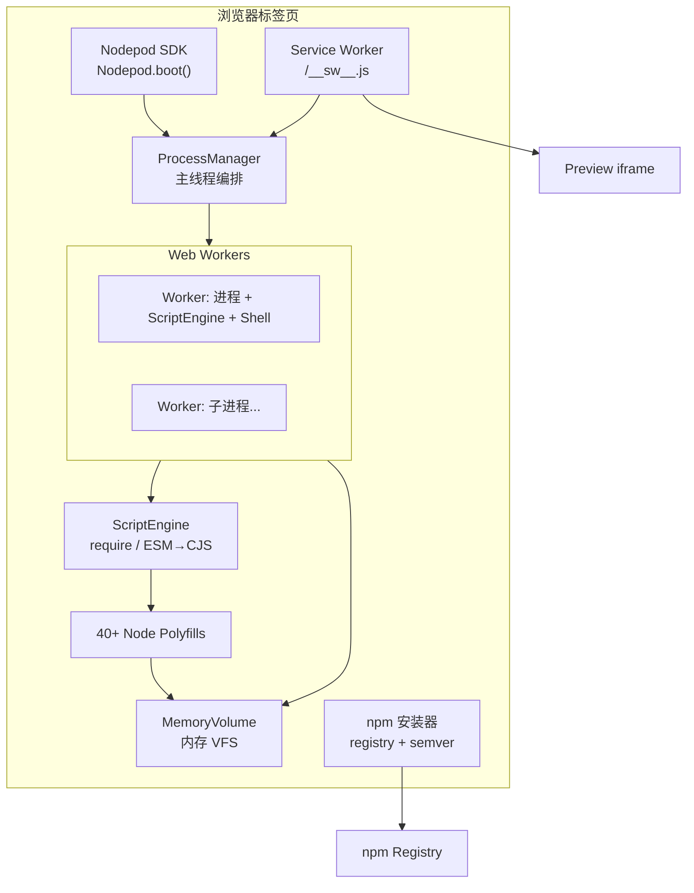

# Nodepod 技术全景报告

> **文档性质**：基于公开资料整理的独立调研报告，与本仓库代码实现无关。  
> **信息截止**：2026 年 5 月（以 Scelar 官方博客、GitHub、npm 等公开源为准）。  
> **对象说明**：下文「Nodepod」特指 **Scelar 开源的浏览器原生 Node.js 运行时**（`@scelar/nodepod`），而非其他同名项目。

---

## 目录

1. [执行摘要](#1-执行摘要)
2. [名称辨析](#2-名称辨析)
3. [问题域与定位](#3-问题域与定位)
4. [项目背景与演进](#4-项目背景与演进)
5. [技术架构](#5-技术架构)
6. [核心能力清单](#6-核心能力清单)
7. [SDK 与集成要点](#7-sdk-与集成要点)
8. [安全模型](#8-安全模型)
9. [已知限制与边界](#9-已知限制与边界)
10. [竞品与方案对比](#10-竞品与方案对比)
11. [生态与参考实现](#11-生态与参考实现)
12. [许可与商业化](#12-许可与商业化)
13. [发布与社区状态](#13-发布与社区状态)
14. [典型场景与反模式](#14-典型场景与反模式)
15. [选型建议](#15-选型建议)
16. [参考资料](#16-参考资料)

---

## 1. 执行摘要

**Nodepod** 是由 [Scelar](https://scelar.com) 团队（主要作者 [@R1ck404](https://github.com/R1ck404)）开发并开源的 **浏览器内 Node.js 运行时**。其核心思路是：在单个浏览器标签页中，用 **TypeScript 编写的 polyfill + 内存虚拟文件系统 + 自研脚本引擎 + Web Worker 进程模型 + Service Worker 网络桥接**，复现 Node.js 开发与运行体验，而 **不依赖** 远程 Linux 容器、也不将完整 Node.js C++ 源码编译为 WebAssembly。

| 维度 | 要点 |
|------|------|
| **一句话** | 让浏览器标签页像一台可跑 `npm install`、起 HTTP 服务、执行 shell 的「迷你计算机」 |
| **主要竞品** | StackBlitz WebContainers（闭源/商业授权为主） |
| **分发** | npm：`@scelar/nodepod`；源码：[ScelarOrg/Nodepod](https://github.com/ScelarOrg/Nodepod) |
| **许可** | MIT + Commons Clause（可商用集成，禁止将 Nodepod 本身转售为独立产品/托管服务） |
| **宣称优势** | 启动约 ~100ms、核心约 ~600KB gzip、MIT 系开源、无按量商业授权门槛 |
| **主要代价** | 无原生 addon、兼容性低于 WebContainers、非强隔离沙箱、默认无持久化 |

官方于 **2026 年 2 月** 通过博客 [Introducing Nodepod](https://scelar.com/blog/introducing-nodepod) 正式对外介绍；npm 首版约 **2026 年 3 月** 发布，至 **2026 年 4 月** 已迭代至 **1.7.x** 系列，开发节奏较快。

---

## 2. 名称辨析

检索「Nodepod」时可能遇到多个无关或弱相关实体，选型与调研时建议先核对包名与组织：

| 名称 | 说明 |
|------|------|
| **@scelar/nodepod**（本文主体） | Scelar 浏览器 Node 运行时，GitHub：`ScelarOrg/Nodepod` |
| **@illuma-ai/nodepod** | npm 上存在的同名/镜像类包，README 内容与 Scelar 版高度一致，集成时以 **scope 与维护方** 为准 |
| **rashidtvmr/Nodepod、illuma-ai/nodepod 等 fork** | 多为上游 fork，非独立产品线 |
| **NodeTool / nodetool.ai** | 工作流 DAG 执行平台，与 Nodepod **无关** |
| **Kubernetes Pod / 其他「node+pod」组合词** | 基础设施术语，非本产品 |

**结论**：技术评估与采购应锁定 **`@scelar/nodepod` + `ScelarOrg/Nodepod`** 作为 canonical 来源。

---

## 3. 问题域与定位

### 3.1 要解决什么问题

传统「在浏览器里跑后端/全栈代码」通常有三条路：

1. **每用户一台远程 VM/容器**（Codespaces、Gitpod、Replit 容器模式等）—— 能力强，但冷启动慢、成本高、运维重。  
2. **专有浏览器运行时**（WebContainers）—— 零后端、体验好，但历史上存在授权、体积、黑盒等问题。  
3. **仅前端 demo**（CodeSandbox 部分模式、静态预览）—— 无法真实 `npm install` 与起服务。

Nodepod 选择第 2 类的 **开源替代路线**，目标用户包括：

- 在线 IDE / Playground  
- 可执行文档与交互教程  
- AI 代码生成产品的 **即时预览**（Scelar 自身即此场景）  
- 教育培训、面试沙箱等 **以 Node/前端工具链为主** 的场景  

### 3.2 不解决什么问题

- 任意系统级依赖（`apt install`、真实 PostgreSQL、GPU 驱动）  
- 不可信用户的 **强安全多租户隔离**（需云沙箱如 E2B/Daytona）  
- 非 JS 语言运行时（Python/Go/Rust 原生生态）  
- 长时间后台任务（标签页休眠即停）  

---

## 4. 项目背景与演进

### 4.1 商业动机

据 Scelar 官方博客，团队在为 AI 应用构建平台 Scelar 集成「浏览器内跑 Node」能力时，评估 **WebContainers 商业授权**：无公开价目、企业销售流程不透明，社区传闻年费可达 **约 $27k/年**（官方称未能核实该数字，但确认「昂贵且不透明」）。因此自研 Nodepod 并 **完全开源**。

### 4.2 技术路线试错（约 10 轮）

官方披露的迭代路径具有参考价值：

| 阶段 | 方案 | 结果 |
|------|------|------|
| 1–2 | 修改 Node.js 源码编译为 WASM | C++/V8/libuv 体量巨大，维护成本不可接受 → 放弃 |
| 3–4 | QuickJS + polyfill | 引擎过简，模块系统与 async 能力不足 → 放弃 |
| 5–7 | 其他 WASM/混合架构 | 慢、重、脆或能力受限 → 放弃 |
| **8–10** | **纯 TS 重写 Node 语义层** | 突破：用浏览器自带 JS 引擎 + polyfill，攻克 sync/async 语义 |

关键难点被描述为：**浏览器没有真正的同步 I/O**，而大量 npm 包假设 `readFileSync`、`require()` 等同步语义成立。Nodepod 通过 `SyncPromise`、`SyncThenable`、`stripTopLevelAwait`、`SharedArrayBuffer` + `Atomics.wait()` 等机制应对。

### 4.3 代码规模（官方数据）

- 约 **119** 个 TypeScript 源文件  
- 约 **33,000** 行源码（不含测试与构建产物）  

---

## 5. 技术架构

可将 Nodepod 理解为标签页内的「迷你操作系统」：



### 5.1 虚拟文件系统（MemoryVolume）

- 内存中的类 POSIX 树形结构，对接 `fs` polyfill（同步/异步/流/监听/glob 等）。  
- 支持 **快照**：JSON 与高性能二进制 `ArrayBuffer` 格式；新 Worker 可通过快照获得 VFS 初始副本。  
- 文件变更触发 watcher，支撑 **Vite HMR** 等场景。  

### 5.2 脚本引擎（ScriptEngine）

- 从 VFS 读入 `.js`/`.ts`，TS 通过 **正则剥离类型**（非完整 tsc）。  
- ESM `import/export` 经 **acorn** 转 AST 后降为 CommonJS `require`。  
- 模块在沙箱函数中 `eval()`，注入 `require`、`module`、`process` 等；显式将 `window`/`document` 置 `undefined`。  
- 全局 `Promise` 替换为 **`SyncPromise`**，以支持「已就绪则同步完成」的 await 路径。  
- 模块解析遵循 Node 算法：`node:` 前缀、内置模块表、`node_modules` 遍历、`package.json` exports 条件导出、循环依赖等。  

### 5.3 Polyfill 层（40+ 内置模块）

**完整实现（官方列举）**：  
`fs`, `path`, `events`, `stream`, `buffer`, `process`, `http`, `https`, `net`, `crypto`, `zlib`, `url`, `querystring`, `util`, `os`, `tty`, `child_process`, `assert`, `readline`, `module`, `timers`, `string_decoder`, `perf_hooks`, `constants`, `punycode`

**桩/简化实现**：  
`dns`, `worker_threads`, `vm`, `v8`, `tls`, `dgram`, `cluster`, `http2`, `inspector`, `domain`, `diagnostics_channel`, `async_hooks`

**不可用时显式抛错**（而非静默失败）：如 `tls`, `dgram`, `cluster`, `http2`。

**特殊 shim**：部分第三方包（如 `chokidar`, `esbuild`, `rollup`, `ws`）在浏览器无法原样运行时，由 Nodepod 内置替代实现注入——官方强调尽量少用 shim，但框架依赖下难以避免。

**开发中**：面向 napi-rs 等原生模块的 **WASM 加载**（如 rolldown、lightningcss）。

### 5.4 同步/异步桥接（核心创新点）

| 机制 | 用途 |
|------|------|
| `SyncThenable` | 已 resolve 的值上 `.then()` 立即同步回调 |
| `SyncPromise` | 作为模块内全局 Promise，优化同步完成路径 |
| `stripTopLevelAwait` | 将顶层 `await` 转为 `syncAwait()`，避免落入原生微任务队列 |
| `SharedArrayBuffer` + `Atomics` | `execSync()` 等真阻塞跨 Worker 通信 |

### 5.5 进程模型

- 每个「进程」= 一个 **Web Worker**，内含独立 VFS 副本、ScriptEngine、Shell。  
- `ProcessManager`（主线程）：spawn（上限约 **50** 进程、**10** 层深度）、信号传播、跨 Worker VFS 同步、虚拟端口 HTTP 路由。  
- VFS 同步：**spawn 时二进制快照** + 运行时消息广播 + 可选 **SharedArrayBuffer 共享 VFS**（只读 attach，见 `Nodepod.attachFS`）。  
- `execSync`：`SyncChannel`（64 slot × 16KB），父 Worker `Atomics.wait()`，超时约 **120s**。  

### 5.6 Shell（自研，约 3500 行 TS）

流水线：**命令替换 `$(...)` → 词法分析 → 递归下降 AST → 解释执行**。

- **35+** 内建命令（文件、目录、文本、搜索、环境等）。  
- 支持管道、重定向、`&&`/`||`、变量默认值 `${VAR:-default}`、glob、命令替换。  
- **非完整 bash**（见限制章节）。  

### 5.7 包管理（浏览器 内 npm）

- 从 **真实 npm registry** 拉元数据，**完整 semver** 解析依赖树。  
- 并行下载/解压（官方称最多约 **12** 包并行、依赖树 **8** 路并发）。  
- 经 **esbuild-wasm**（Worker 池）将 ESM 包转为 CJS；写入 `node_modules/.bin` stub。  
- 性能参考（官方）：Express 全量安装约 **3–5s**；缓存命中约 **50ms**。  
-  tarball **`shasum` 校验**。  

### 5.8 网络与预览（Service Worker 桥）

- 虚拟服务监听端口后，注册到进程内 **server registry**。  
- Service Worker 拦截 `/__virtual__/{port}/...` 等 URL，将请求路由到对应 Worker。  
- 支持 **WebSocket**（`BroadcastChannel` 中继）、流式响应、预览 iframe **脚本注入**。  
- 本地 `http.request` 到 localhost 可 **进程内直连**，不走真实网络。  

**集成硬约束**：SW 必须从 **站点自身 origin** 提供（默认路径 `'/__sw__.js'`），**不能** 直接从 `node_modules` 注册；否则 `boot()` 抛出 `NodepodSWSetupError`。测试/SSR 可 `{ serviceWorker: false }` 跳过。

---

## 6. 核心能力清单

| 能力 | 支持情况 | 备注 |
|------|----------|------|
| `require` / `import` | ✅ | ESM→CJS 转换 |
| TypeScript 执行 | ✅ | 正则剥类型，非完整类型检查 |
| `npm install` / CLI 脚手架 | ✅ | 含交互式 `npm create` 等 |
| Express / Hono / Elysia | ✅ | 虚拟 HTTP 服务 |
| Vite + 主流前端框架 | ✅ | React/Vue/Svelte/Solid/Lit 等 |
| Next.js 原生 | ❌/部分 | webpack 阻塞；**Vinext**（Vite 系 Next 替代）可工作 |
| xterm 终端 | ✅ | `createTerminal()` |
| 文件快照 save/restore | ✅ | 可自建持久化 |
| 原生 Node addon（sharp 等） | ❌ | 浏览器无法加载 C++ addon |
| 真实 TLS/socket | ❌ | 桩或抛错 |
| 对称加密 `createCipheriv` | ❌ | 哈希/HMAC/随机数可用 Web Crypto |
| 强隔离不可信代码 | ❌ | 同页 JS 上下文 |

---

## 7. SDK 与集成要点

### 7.1 安装

```bash
npm install @scelar/nodepod
```

亦可通过 unpkg / jsDelivr CDN 引入（见官方 README）。

### 7.2 最小启动

```typescript
import { Nodepod } from '@scelar/nodepod';

const nodepod = await Nodepod.boot({
  files: {
    '/index.js': 'console.log("Hello from the browser!")',
  },
});

const proc = await nodepod.spawn('node', ['index.js']);
proc.on('output', (text) => console.log(text));
await proc.completion;
```

### 7.3 `Nodepod.boot(options)` 主要选项

| 选项 | 说明 |
|------|------|
| `files` | 初始虚拟文件树 |
| `workdir` | 工作目录，默认 `/` |
| `env` | 环境变量 |
| `swUrl` | Service Worker URL（预览 iframe） |
| `watermark` | 预览角标，默认 `true` |
| `onServerReady` | 虚拟服务监听回调 `(port, url)` |
| `allowedFetchDomains` | CORS 代理白名单；`null` 表示允许全部（风险自负） |
| `serviceWorker` | 设为 `false` 可跳过 SW（SSR/单测） |

### 7.4 实例 API（节选）

| 方法 | 作用 |
|------|------|
| `spawn(cmd, args?)` | 执行命令，返回 `NodepodProcess` |
| `install(packages)` | 安装 npm 包 |
| `createTerminal(opts)` | 绑定 xterm.js |
| `fs.*` | 异步 VFS 门面 |
| `request(port, method, path)` | 向虚拟 HTTP 服务发请求 |
| `snapshot()` / `restore()` | 文件系统快照 |
| `setPreviewScript` / `clearPreviewScript` | 预览 iframe 注入 |
| `port(num)` | 获取端口预览 URL |
| `attachFS(buffer)` | 兄弟 Worker 只读挂载共享 VFS（需 COOP/COEP） |

### 7.5 部署清单（生产集成）

1. 将 `static/__sw__.js` 暴露到站点根路径（或配置 `swUrl`）。  
2. 若使用 `SharedArrayBuffer` / `execSync` / `attachFS`：配置 **COOP/COEP**（`Cross-Origin-Opener-Policy: same-origin`、`Cross-Origin-Embedder-Policy: require-corp`），并排查第三方脚本是否破坏隔离。  
3. 规划 **快照持久化**（IndexedDB/后端）若需跨刷新保留工作区。  
4. 明确 **allowedFetchDomains**，避免开放代理被滥用。  
5. 在 product 文案中区分：**预览环境 ≠ 生产 Node 服务器**。  

---

## 8. 安全模型

Nodepod README 列出多层 **缓解措施**（非等价于云沙箱）：

| 措施 | 说明 |
|------|------|
| CORS 代理域名白名单 | 默认仅 npm/GitHub/esm.sh 等；可扩展或 `null` 全开放 |
| Service Worker 鉴权 | 控制消息需 boot 时生成的随机 token |
| WebSocket 桥鉴权 | BroadcastChannel 带 token |
| 包完整性 | 校验 registry `shasum` |
| iframe sandbox | `sandbox="allow-scripts"` 限制导航/弹窗/表单 |
| 跨域消息校验 | sandbox 页校验 `event.origin` |

**重要声明（官方博客与 README 一致）**：代码运行在 **浏览器同源 JS 上下文**，对 **不可信用户代码** 不具备 VM 级强隔离；恶意代码仍可能通过钓鱼、过度 `allowedFetchDomains`、社会工程等方式造成危害。面向公众的多租户执行应使用 **E2B、Firecracker、gVisor、独立浏览器配置文件** 等方案，或严格限制网络与 API。

---

## 9. 已知限制与边界

### 9.1 功能限制

1. **无原生 addon**：`sharp`、`better-sqlite3`、`puppeteer` 等不可用。  
2. **默认无持久化**：刷新即失；需自行 `snapshot` + 存储。  
3. **Shell 非 bash 超集**：无数组、brace expansion 等高级脚本。  
4. **加密 API 不完整**：对称加解密抛错。  
5. **兼容性低于 WebContainers**：边缘 Node 行为、Next 原生、部分 CLI 可能失败。  
6. **浏览器内存上限**：超大 monorepo 可能 OOM。  
7. **标签页生命周期**：休眠/关闭即终止。  
8. **移动端**：RAM 与 API 限制更明显。  

### 9.2 架构性限制

- **同步语义是模拟的**：依赖大量定制 Promise/转换，升级 Node 或极端包可能踩坑。  
- **eval 执行模型**：与安全审计、CSP、企业合规策略可能冲突。  
- **Service Worker 依赖**：预览与虚拟 HTTP 强绑定 SW 生命周期与更新策略。  

---

## 10. 竞品与方案对比

### 10.1 Nodepod vs WebContainers

| 维度 | Nodepod | WebContainers (StackBlitz) |
|------|---------|---------------------------|
| 开源 | 源码开放（MIT+Commons） | 部分专有 |
| 授权成本 | 无按量授权叙事 | 企业销售、价目不透明 |
| 启动时间 | ~100ms（宣称） | ~2–5s（宣称） |
| 核心体积 | ~600KB gzip（宣称） | 数 MB WASM |
| Node 兼容度 | 40+ 模块，场景驱动 | ~95%（宣称） |
| 实现路径 | TS polyfill + 浏览器 JS | WASM 化 Node 栈 |
| Next.js 等 | 原生 Next 受限；Vinext 可行 | Next/Nuxt 等支持更好 |
| 供应商锁定 | 低 | 相对较高 |

**结论**：WebContainers 在 **兼容广度与成熟度** 上仍领先；Nodepod 在 **成本、可控性、启动体积、开源可 fork** 上具吸引力。多数「跑 Vite + Express 预览」场景两者均可评估 POC。

### 10.2 与云沙箱（E2B / Daytona 等）

| 维度 | Nodepod | E2B / Daytona 等 |
|------|---------|------------------|
| 运行位置 | 用户浏览器 | 云端 Linux VM |
| 冷启动 | ~100ms 级 | 数百 ms ~ 数秒 |
| 语言/系统包 | 基本仅 Node/JS 生态 | 任意 Linux 软件 |
| 网络隔离 | 同源 + 白名单代理 | 可配置 VPC/防火墙 |
| 数据出境 | 可做到纯本地 | 代码在第三方云 |
| 适用 | 演示、教学、可信生成代码预览 | Agent 工具调用、不可信代码、长任务 |

### 10.3 与远程开发环境（Codespaces / Gitpod）

- **Codespaces/Gitpod**：真实 Linux，适合严肃开发与多语言；成本高、启动慢。  
- **Nodepod**：零后端运维，适合 **嵌入产品 UI 的即时沙箱**，而非替代完整开发机。  

---

## 11. 生态与参考实现

| 项目 | 关系 | 说明 |
|------|------|------|
| [Scelar](https://scelar.com) | 主力消费方 | AI 应用构建平台，Nodepod 最初为其预览/runtime 而生 |
| [wZed](https://wzed.scelar.com/) | 参考 IDE | 基于 Nodepod 的浏览器 IDE（Monaco、xterm、分屏、预览联动） |
| [ScelarOrg/wZed](https://github.com/ScelarOrg/wZed) | 开源仓库 | 展示 Nodepod 上限的示范工程 |

**wZed 能力摘要**（官方描述）：多语言语法高亮、可拖拽分屏、集成终端、文件树与 VFS 同步、服务启动后预览自动导航、命令面板、全局搜索、可定制键位（VSCode/JetBrains/Vim 预设）、多主题。

---

## 12. 许可与商业化

### 12.1 许可证

npm 标注：**MIT WITH Commons Clause**。

通俗理解（摘自官方 README）：

- ✅ 自由使用、修改、在商业产品中集成  
- ✅ 基于 Nodepod 构建并销售 **你自己的应用**  
- ❌ 不得将 Nodepod **本身**  rebranding 后作为 **独立产品或托管运行时服务** 转售  

（博客中有时简写为「MIT」；法务评估应以 **仓库 LICENSE 全文** 为准。）

### 12.2 与 WebContainers 商业策略差异

Nodepod 将「浏览器内 Node」从 **潜在高额授权费** 转为 **基础设施开源 + 自建集成成本**，适合创业公司、教育平台、文档站、AI IDE 等不愿被单一供应商锁价的团队。

---

## 13. 发布与社区状态

> 以下数据来自 npm/GitHub 公开页，随时间变化，集成前请自行复核。

| 指标 | 约值（2026 年 4–5 月） |
|------|------------------------|
| npm 包名 | `@scelar/nodepod` |
| 最新版本线 | **1.7.x**（如 1.7.2，2026-04-22 量级） |
| 首版发布时间 | 约 2026-03-02 |
| 版本数量 | ~25 个（快速迭代期） |
| 周下载量 | ~数百–近千（npm 公开统计，增长中） |
| GitHub Stars | ~70–80 量级（ScelarOrg/Nodepod） |
| 主要维护者 | @R1ck404（自述 Nodepod 非主业，Scelar 优先） |

**近期版本方向（从 changelog 可见）**：

- v1.5：事件循环 / libuv 语义对齐、`HandleRegistry`、退出语义测试加强  
- v1.6：`Nodepod.attachFS`、兄弟 Worker 共享 VFS  
- 持续补强：`timers`、`child_process`、`readline`、HTTP 等 polyfill  

---

## 14. 典型场景与反模式

### 14.1 适合

- AI 生成全栈/Node 项目的 **秒级预览**  
- 文档站 **可运行示例**（纯 JS 依赖）  
- 编程教育 **零安装实验环境**  
- 内部工具 **可信脚本** 的快速验证  
- 希望 **避免 WebContainers 商业谈判** 的自研 IDE  

### 14.2 不适合

- 公众可提交任意代码的 **竞赛/OJ 沙箱**（无强隔离）  
- 依赖 **大量原生模块** 的后端（图像处理、本地 DB 驱动）  
- **长时间构建/批处理**（CI 应用云 runner）  
- 需要 **真实 HTTPS 证书、出站任意 TCP** 的服务  
- 必须 **100% Node LTS 行为兼容** 的回归测试基线（应用真实 Node CI）  

---

## 15. 选型建议

```text
是否需要「用户浏览器内、零后端」？
├─ 否 → 优先考虑 Codespaces/Gitpod/E2B/Daytona
└─ 是 → 是否以 Node/npm 生态为主？
    ├─ 否 → WebContainers 不适用；换云沙箱或多语言方案
    └─ 是 → 预算/可控性/开源是否敏感？
        ├─ 需要最高兼容 + 官方 Next 等 → 评估 WebContainers
        ├─ 需要开源、可 fork、低启动体积 → 评估 Nodepod POC
        └─ 不可信代码 + 要强隔离 → Nodepod 仅作 UI 层，执行放 E2B 等
```

**POC 建议步骤**：

1. 用目标框架（如 Vite + React + 常用 npm 包）在 wZed 或最小 `boot()` 示例中跑通。  
2. 验证 SW 部署路径与 COOP/COEP。  
3. 压测最大 `node_modules` 体积与内存峰值。  
4. 对照法务审阅 **Commons Clause** 与产品分发方式。  
5. 列出项目 **硬依赖原生模块** 清单，一项项排除或换 WASM 替代。  

---

## 16. 参考资料

| 资源 | URL |
|------|-----|
| 官方介绍博客 | https://scelar.com/blog/introducing-nodepod |
| 源码仓库 | https://github.com/ScelarOrg/Nodepod |
| npm 包 | https://www.npmjs.com/package/@scelar/nodepod |
| 在线演示 IDE | https://wzed.scelar.com/ |
| wZed 仓库 | https://github.com/ScelarOrg/wZed |
| Scelar 组织 | https://github.com/ScelarOrg |

---

## 附录 A：术语表

| 术语 | 含义 |
|------|------|
| MemoryVolume | Nodepod 内存虚拟文件系统实现 |
| ScriptEngine | 模块加载与执行核心 |
| SyncPromise | 支持同步完成路径的自定义 Promise |
| 虚拟 HTTP 服务 | 监听端口由 SW/ProcessManager 路由的请求处理 |
| Vinext | 基于 Vite 的 Next.js 替代方案，可在 Nodepod 内运行 |
| Commons Clause | 限制将软件本身作为商业服务转售的附加条款 |

## 附录 B：报告方法论

本报告通过以下公开渠道交叉验证：Scelar 官方博客（架构与对比数据）、GitHub README（API/安全/目录结构）、npm registry（版本与许可）、GitHub compare（版本间功能）、第三方技术文章（WebContainers 行业背景）。**未**对 Nodepod 源码做独立审计或性能基准复现；性能与兼容性数字均标注为「官方宣称」，实际项目应自行 benchmark。

---

*文档版本：v1.0 | 生成目的：技术调研与选型参考*
