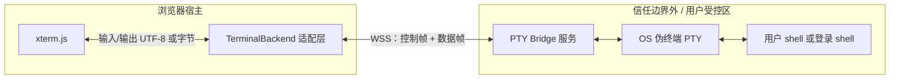

# SDD Spec: WebContainer OpenClaw — VS Code 级终端体验路线图

## RIPER 状态机（热上下文）

| 字段 | 值 |
|------|-----|
| **phase** | `Plan`（**§4.2.5 Phase D 技术方案** 已细化；Execute 仍待 `Plan Approved`） |
| **approval status** | 待 **`Plan Approved`**；**Phase D** 另需 **PRD 修订**（若将远端 PTY 列为对外 Must） |
| **spec path** | `docs/specs/2026-04-30_21-00_WebContainer-OpenClaw-VSCode级终端体验路线图.md` |
| **active_project** | `webcontainer-openclaw` |
| **active_workdir** | `demos/webcontainer-openclaw` |
| **change_scope** | `local` |
| **父级真相源** | [prd-webcontainer-openclaw.md](../prd/prd-webcontainer-openclaw.md)；终端实现契约 [2026-04-30_18-03_WebContainer-OpenClaw-终端与预览.md](./2026-04-30_18-03_WebContainer-OpenClaw-终端与预览.md)。**冲突时以 PRD 为准。** |

---

## 0. Open Questions

- [x] **Phase D**：用户要求 **Phase D（真 PTY）** 并更新技术方案 —— **§4.2.5** 为本版权威说明。
- [ ] **「VS Code 级」对外承诺档位**：是否将 **Phase B** 作为对外话术上限、**Phase D** 作为「需远端桥 / 可选能力」单独披露。
- [ ] **作用域是否含 `apps/web`**：本专规默认仅 `demos/webcontainer-openclaw`；Phase D **桥服务**可部署在 monorepo 新包或独立仓库（待决）。
- [ ] **多会话 / 分屏**：当前 PRD **Out-of-Scope**；Phase D **单 WSS 会话对应单 PTY** 不自动等同「产品级多 Tab」；多 PTY 仍可能需 **Phase C + PRD**。
- [ ] **桥接鉴权模型**：仅演示 Token、登录用户会话、还是 mTLS + 固定设备（影响协议 §4.2.5.5 与部署 §4.2.5.7）。

---

## 1. Requirements (Context)

### 1.0 Goal

- 将「**VS Code 级集成终端体验**」拆成 **可验证、可分阶段交付** 的能力包，并与现有 **PRD / 终端 Spec** 对齐，避免口头目标与 **Out-of-Scope**（真 PTY 等价、多会话 UI）静默冲突。
- 为后续 Execute 提供 **Phase A–D** 的验收边界与依赖说明（**本文件不替代** `18-03` 中已闭合的 M1–M3 契约；**增强项**在对应 Phase 获批后追加 checklist）。

### 1.1 In-Scope（本专规）

- 体验维度拆解、与 VS Code（xterm + PTY + 壳集成）的 **差距表**。
- **Phase A–D** 路线图、每阶段 **验收要点（AC）**、**显式不包含** 声明。
- 与父 Spec 的 **交叉引用**（不重复抄写全文实现细节）。

### 1.2 Out-of-Scope（本专规）

- 不在未修订 PRD 的前提下，把 **Phase D** 写成「**纯 WebContainer 内** 与 OS PTY 完全等价」（仍须 **远端真 PTY**）。
- **Phase D 桥服务**的可执行代码、CI、密钥管理：本文件只给到 **架构与协议级契约**；落地文件路径在 Execute 阶段写入父 Spec或子 Spec。

### 1.3 Context Sources

- **PRD**：`docs/prd/prd-webcontainer-openclaw.md`（§3.1「VS Code 终端式体验」、§3.2 不包含项）。
- **可行性（执行面外置）**：[feasibility-openclaw-webcontainers.md](../research/feasibility-openclaw-webcontainers.md)（**S1** 与 Phase D 一致）。
- **实现契约与现状**：`docs/specs/2026-04-30_18-03_WebContainer-OpenClaw-终端与预览.md`。
- **宿主工程化**：`docs/specs/2026-04-30_19-45_WebContainer-OpenClaw-Svelte迁移与工程化.md`。
- **对话决议**：用户要求将「VS Code 级体验」规划 **持久化到文档**；此前仅对话交付的原因：当时未明确要求落盘 + 遵守「未要求则不改 markdown」的协作边界。

### 1.5 Codemap Used

- **Codemap File**：_未生成_（可选：`create_codemap(feature=webcontainer-openclaw-终端)`）。
- **Key Index**：`src/terminal.ts`（配置、截断、drain）；终端 UI：`TerminalPanel` / 等价 Svelte 组件；`WebContainer.spawn` 与 stdin 泵链路见父 Spec §2.2 / §4。

### 1.6 Context Bundle Snapshot

- **Bundle Level**：`Lite`（本路线图自包含）。
- **Key Facts**：浏览器内无原生 PTY；WebContainer 使用 **流式 stdio**，与 Electron `node-pty` 栈语义不同；「完整」终端需分层逼近或远端 PTY。

---

## 2. Research Findings

### 2.1 「VS Code 级」两层含义（避免歧义）

| 层级 | 含义 | 与本项目关系 |
|------|------|----------------|
| **L1（PRD 已对齐）** | xterm 呈现、输入在终端内、流式输出、stdin 泵、单会话、Tab 布局、基本管理 | 父 Spec + PRD 已覆盖；持续手测与文档即可 |
| **L2（体验逼近）** | Search/WebLinks、历史召回、工具条、轻量 OSC/壳集成装饰 | 本专规 **Phase B** |
| **L3（IDE 一体化）** | 多终端、Tasks/Debug 共用、扩展 API | **多会话 = PRD 变更**；demo 级可降级为「预设命令」 |
| **L4（真 PTY）** | SIGWINCH、job control、全屏 TUI 与本地一致 | **PRD Out-of-Scope**；仅 **远端 PTY** 或单独产品 |

### 2.2 能力矩阵（简化）

| 能力块 | VS Code（简化） | WC + 浏览器 | 建议 Phase |
|--------|-----------------|-------------|------------|
| VT/ANSI | xterm + addons | 同源 | A 基线 + B addon |
| 进程 I/O | node-pty ↔ xterm | `spawn` + Readable/Writable | A（已有） |
| 尺寸 / SIGWINCH | PTY 行列 | 视 SDK | A/B 查 API 后写入父 Spec「支持/不支持」 |
| Shell integration（OSC 633 等） | 装饰条、命令块 | 解析输出可选 | B（Should） |
| 多终端 / 分屏 | 多 PTY | — | C（需 PRD） |
| 真 PTY 语义 | 内核 TTY | 浏览器无；**远端 D1/D2/D3 桥** | **D（§4.2.5）** |

### 2.3 风险

- **R-OSC**：stdout/stderr 合并时 OSC 序列可能被截断或打乱；壳集成需定义 **最小支持集** 与降级。
- **R-期望**：对外文案若不标明 Phase，Review 时无法判定「VS Code 级」是否达成。
- **R-D-PTY**：远端 Shell 等同 **RCE 面**；任何 Token 泄露、**CSP `connect-src` 过宽**、或桥监听 `0.0.0.0` 无鉴权，均为 **高危**。MVP 必须 **127.0.0.1 + 一次性 Token** 或等价控制。
- **R-D-WSS**：跨源 WSS 需明确 **证书与混合内容**；开发期推荐 **同源反向代理**（见 §4.2.5.10）。

### 2.4 Next Actions

1. 产品确认 **§0 Open Questions**（鉴权模型、桥部署位置、`apps/web` 是否纳入）。
2. **Phase D Execute 前**：完成 **§4.2.5.9** PRD/父 Spec/README 协同勾选（或显式「User Decision: Proceed」）。
3. 收到 **`Plan Approved`** 后：按 **§4.3** Phase D 子清单进入实现；PoC 证据写入 **§5 Execute Log**。
4. （可选）补 `create_codemap(feature=webcontainer-openclaw-终端)`。

---

## 3. Innovate（可选）

- **Phase B**：`Skip`：`true`（具体 xterm addon 列表在 Phase B Plan 中再选）。
- **Phase D（已决议草案）**：桥实现 **默认 D1**（自研薄桥 + `node-pty`）；可用 **D2** 替换桥进程但须补齐协议适配说明。**D3/D4** 不进入 `webcontainer-openclaw` 首期 PoC，除非单独立项。

---

## 4. Plan（Contract）

### 4.1 与父 Spec 关系

- **Phase A**：不扩大 PRD；验收对齐 **PRD + `18-03` §7** 已列项。
- **Phase B 及以后**：每项进入 Execute 前须在父 Spec `Change Log` 或本文件 **§8** 记录决议，且不得与 PRD **Out-of-Scope** 矛盾（除非 PRD 已修订）。

### 4.2 Phase 定义与验收（AC）

#### Phase A — PRD 声称的「VS Code 式」闭环

- **内容**：xterm Fit、主题/字体/cursor、二态输入（整行 `sh -c` vs stdin 转发）、运行中策略 + 中止、焦点与 Tab 无障碍底线、README 已知限制。
- **AC**：父 Spec §7 与 PRD 核心旅程手测全绿；对外说明含「与真 PTY 差异」。

#### Phase B — 单会话下的体验逼近

- **内容**：xterm addons（Search、可选 WebLinks/Unicode11 等按需选型）、命令历史（↑ 召回规则写清）、工具条（清空/复制/中止/预设）、可选轻量 OSC → 状态装饰。
- **AC**：不引入多会话；交互 CLI + 长日志场景可日常试用；addon 包体与 COI 环境可接受。

#### Phase C — 多会话 / 类 Tasks（仅当 PRD 修订后）

- **内容**：多 `spawn` 生命周期、UI IA、资源上限。
- **AC**：以修订后 PRD 为准；本专规不预写 checklist。

#### Phase D — 真 PTY（远端 PTY 桥）

- **摘要**：浏览器内 **不创建** OS PTY；通过 **受控远端**（本机侧车、LAN、VPS）运行 **`node-pty` 或等价**，经 **WebSocket（推荐）** 与 **xterm.js** 双向转发字节流，实现 **SIGWINCH/全屏 TUI/行规约** 等尽可能贴近 VS Code 集成终端的体验。
- **AC（产品级）**：在约定网络与鉴权配置下，`vim`/`htop`/`less` 等全屏 TUI **可用**；resize 后布局正确；长时间会话有心跳与断线提示；安全模型与数据流在 README/运维文档中 **可审计**。
- **详细技术方案**：见 **§4.2.5**。

##### §4.2.5 Phase D — 真 PTY 远端桥（技术方案）

###### 4.2.5.1 目标与非目标

| 类型 | 说明 |
|------|------|
| **目标（Must）** | 单用户（或单会话）下，终端 **后端 = 真 PTY**；xterm 与 PTY **字节级透明**（含控制序列）；支持 **cols/rows 变化 → SIGWINCH**；支持 **优雅断开**与重连策略（至少文档化）。 |
| **目标（Should）** | 与 VS Code 类似的 **环境变量注入**（`TERM`、`COLORTERM` 等）；**仅审计模式**下的会话录屏/只读镜像（另立项）。 |
| **非目标（Won’t，除非另 Spec）** | 在 **纯 WebContainer `spawn` 流** 内宣称达成 OS PTY 等价；无鉴权的公网「任意人 Shell」；与 OpenClaw 网关通道 **混为同一进程**（应 **进程与信任域隔离**）。 |

###### 4.2.5.2 架构概览

- **关键点**：`webcontainer-openclaw` 继续承担 **WC 沙箱**；Phase D 为 **第二条终端后端**（`RemotePtyBackend`），与现有 `WebContainerProcess` 路径 **二选一或显式切换**（禁止静默混用导致安全误解）。

###### 4.2.5.3 方案比选

| ID | 描述 | 优点 | 缺点 | 适用 |
|----|------|------|------|------|
| **D1** | **自研薄桥**：Node（`node-pty`）或 Go（`creack/pty` 等）+ 自定义 **JSON/二进制** WebSocket 协议 | 协议最小、易嵌入现有 monorepo、易加鉴权与审计钩子 | 自建运维与版本兼容 | **默认推荐 PoC** |
| **D2** | **现成 Web 终端网关**：如 `ttyd`、`wetty`、**Apache Guacamole** SSH 层等 | 省开发、久经沙场 | 协议/部署与 UI 耦合、定制与 SSO 集成成本 | 企业内网、快速验证 |
| **D3** | **标准 SSH**：浏览器侧 `ssh2`（wasm/JS）或 **WebSocket 转 SSH**（网关侧 `sshd`） | 与现有运维体系一致 | 浏览器 WASM 性能与指纹问题；或仍需可信转接层 | 已有 SSH 堡垒机场景 |
| **D4** | **Electron / 本机 OpenClaw Desktop** 内嵌真终端 | 体验最佳 | **非 Web 纯浏览器**；与当前 demo 技术栈分离 | 桌面产品线 |

**决议（本 Spec 草案）**：PoC 与首期实现优先 **D1**；若组织已有 **D2** 标准镜像，允许 **D2 作为 Bridge 实现** 但须在 **§4.2.5.5** 增加「兼容配置文件」说明对外协议差异。

###### 4.2.5.4 与可行性研究的对齐

- [feasibility-openclaw-webcontainers.md](../research/feasibility-openclaw-webcontainers.md) **S1**：网关/执行面在 **本机或 VPS**；浏览器为控制面 —— Phase D **PTY 桥**属于同一哲学：**执行面离开浏览器沙箱**。
- Phase D **不**解决 WC 内 native/OpenClaw 全功能；仅解决 **「真终端」体验** 这一条轴。

###### 4.2.5.5 桥接协议（草稿契约）

> 实现可自由选择 **JSON 文本帧**（易调试）或 **二进制多路复用**（低开销）；以下以 **最小可互操作子集** 描述。

**传输**：`wss://`（生产必须 TLS）；首帧或 HTTP 升级前完成 **鉴权**（见 §4.2.5.7）。

**客户端 → 服务端（示例类型）**：

| `type` | 载荷 | 语义 |
|--------|------|------|
| `auth` | `{ token }` 或 `{ ticket }` | 建立会话前握手；服务端返回 `auth_ok` / `auth_err` |
| `resize` | `{ cols, rows }` | 调整 PTY 尺寸并触发 **SIGWINCH**（由 `node-pty` 等实现） |
| `data` | `{ payload: base64 \| string }` | 用户输入写入 PTY **master** |
| `ping` | `{ t }` | 心跳；服务端 `pong` |

**服务端 → 客户端**：

| `type` | 载荷 | 语义 |
|--------|------|------|
| `data` | PTY 输出 | 写入 xterm `write` |
| `exit` | `{ code, signal? }` | 子进程结束；UI 复位或允许重连 |
| `error` | `{ message, code }` | 可展示错误；**禁止**将任意服务器栈泄露给不可信终端用户 |

**背压**：服务端在 PTY 读缓冲过大时应 **暂停 read 或降频推送**；客户端对 xterm `write` 可 **分帧** 避免长任务阻塞主线程（与现有 `terminal.ts` 截断策略 **独立配置**）。

###### 4.2.5.6 与 `demos/webcontainer-openclaw` 宿主集成

1. **抽象**：引入 **`TerminalBackend` 接口**（概念名）：`connect(config) | disconnect() | sendUserInput(bytes) | onPtyData(cb) | resize(cols, rows)`；现有 WC 路径为 `WebContainerBackend`，Phase D 为 `RemotePtyWebSocketBackend`。
2. **UI**：设置或工具条 **「终端后端：WebContainer | 远端 PTY」**；切换时 **断开旧后端**、清空或保留 xterm 缓冲（行为写死一种并文档化）。
3. **配置**：新增 **`pty-bridge.config.json`**（或与 `terminal.config.json` 分字段合并），至少包含：`bridgeUrl`、`authMode`、`reconnectMax`、`colsRowsSyncWithFitAddon`。
4. **COOP/COEP**：仅影响 **WC**；WSS 到 **同源或显式配置域** 时需注意 **混合内容** 与 **CSP `connect-src`**。

###### 4.2.5.7 安全、运维与合规

| 主题 | 最低要求 |
|------|-----------|
| **鉴权** | 禁止匿名公网 Shell；默认 **短期 Token** 或 **OIDC 代理签发**；日志不落明文密钥。 |
| **授权** | 桥服务仅监听 **localhost** 或 **内网**；若暴露公网须 **速率限制 + IP 允许列表 + 审计**。 |
| **隔离** | 桥进程 **低权限 Unix 用户** / 容器 cgroup；可选 **命令白名单**（与「真 PTY」互斥时需产品二选一）。 |
| **浏览器侧** | 明确提示：「远端 PTY = 在 **该服务器** 上执行命令」，与 WC 沙箱 **不同信任域**。 |

###### 4.2.5.8 验收与 PoC 边界

- **PoC**：本机启动 D1 桥（监听 `127.0.0.1`）→ demo 页连接 → `vim` 全屏编辑保存退出 → `resize` 窗口 TUI 重排正确 → 断网重连行为符合文档。
- **非 PoC**：多用户租户隔离、会话持久化集群、合规认证（SOC2 等）—— **另 Spec**。

###### 4.2.5.9 PRD / 父 Spec 协同变更清单（Execute 前检查）

- [ ] **PRD §3.2**：增加「**可选远端真 PTY（Phase D）**」与 **信任域说明**；或单列 **附录：远端终端**。
- [ ] **父 Spec `18-03`**：增加「双后端」相关 **File Changes** 与 **Validation**；WC 单会话语义与 Remote PTY **并发策略**（建议：**互斥**，避免双执行面混淆）。
- [ ] **README**：用户如何启动桥、如何配置 URL、**安全警告**。

###### 4.2.5.10 开发与部署拓扑（补充）

| 场景 | 建议 |
|------|------|
| **本地开发** | 桥监听 `127.0.0.1:<port>`；Vite **`server.proxy`** 将路径如 `/pty-ws` **升级到 WebSocket** 并转发到桥，使浏览器 **同源** 连 `wss://localhost:<vite>/pty-ws`，简化 CSP 与 Cookie。 |
| **同源生产** | 反向代理（Nginx/Caddy）对 **`/pty-ws` 做 `Upgrade`**；TLS 终止在边缘；桥仅接内网回源。 |
| **跨域 WSS** | 显式配置 `bridgeUrl` + 浏览器 **CORS 不适用 WSS**（握手仍受浏览器连接规则约束）；须 **有效 TLS** 与明确 `connect-src`。 |

**桥进程技术栈（D1 建议）**：Node **LTS**（与仓库一致即可）+ `ws` 或 `uWebSockets.js`（择一；PoC 优先 **`ws` + 少依赖**）+ `node-pty`；单二进制/单 `pnpm` 包均可，以 **可 `pnpm exec` 一键启动** 为 PoC 验收友好度目标。

###### 4.2.5.11 重连与 PTY 生命周期（补充）

| 策略 | 说明 | 建议默认 |
|------|------|----------|
| **断线即杀** | WebSocket 关闭 → 桥向 PTY 发 **SIGHUP/SIGTERM** 并回收 | **PoC 默认**（行为简单、无悬挂 shell） |
| **断线保留** | 会话 ID 绑定 PTY，短时重连可附着 | 需会话表与超时 GC；**Phase D+** |
| **多端互斥** | 同一 Token 仅允许 **单 WebSocket** | Should（防共享链接） |

###### 4.2.5.12 协议错误码（草案，MVP）

| `code` | 含义 | 客户端行为 |
|--------|------|------------|
| `AUTH_REQUIRED` | 未鉴权或 Token 缺失 | 展示配置说明；不重试 |
| `AUTH_INVALID` | Token 过期或签名错误 | 清除本地 Token；不重试 |
| `BRIDGE_LIMIT` | 并发会话已满 | 提示稍后；可退避重试 |
| `SPAWN_FAILED` | `node-pty` / shell 启动失败 | 展示 `message`（脱敏）；不重试 |
| `INTERNAL` | 未分类服务端错误 | 通用错误文案；**不**展示原始堆栈 |

### 4.3 Implementation Checklist（占位）

- [ ] **Phase A**：父 Spec 已闭合项 —— 本清单 **不重复勾选**；仅用于 **回归/手测** 时引用 `18-03` §4.3.1。
- [ ] **Phase B**：待 **`Plan Approved`** 后拆分为原子项（addons、历史、工具条、OSC 最小集）并写入父 Spec或本子节。
- [ ] **Phase C**：待 PRD 修订（多会话）后再填。
- [ ] **Phase D — 协议与桥服务**
  - [ ] 定稿 **§4.2.5.5** 帧类型与错误码；选 JSON 或二进制之一为 **MVP 唯一实现**。
  - [ ] 实现 **D1 桥**最小进程：鉴权握手 + `node-pty` spawn + resize + 双向 pump + 心跳。
  - [ ] demo 宿主：`TerminalBackend` 抽象 + `RemotePtyWebSocketBackend` + UI 切换 + `pty-bridge.config.json`。
  - [ ] 文档：README 启动桥、信任域、与 WC 差异；完成 **§4.2.5.8** PoC 手测记录（写入 §5 Execute Log）。

### 4.4 Validation（专规级）

- **本文件**：链接可达、Phase 与 PRD **Out-of-Scope** 无矛盾表述。
- **各 Phase Execute 后**：按父 Spec §5 / `review_execute` 三轴验证。

---

## 5. Execute Log

- _尚无；本文件为路线图专规。_

---

## 6. Review

- _待 Phase B 首次 Execute 后补 `review_execute` 结论链接或摘要。_

---

## 7. Plan-Execution Diff

- _N/A_

---

## 8. Change Log（Spec 本体）

| 日期 | 摘要 |
|------|------|
| 2026-04-30 | 首版：VS Code 级体验分层（L1–L4）、Phase A–D、能力矩阵、Open Questions；回应「规划应落盘」诉求。 |
| 2026-04-30 | **Phase D**：§4.2.5 真 PTY 远端桥技术方案（架构、mermaid、D1–D4 比选、协议草稿、宿主集成、安全、PoC、PRD 协同清单）；§4.3 Phase D checklist；风险 R-D-*；§4.2.5.10–.12 部署/重连/错误码；RIPER/Research/Innovate/Context 对齐。 |
