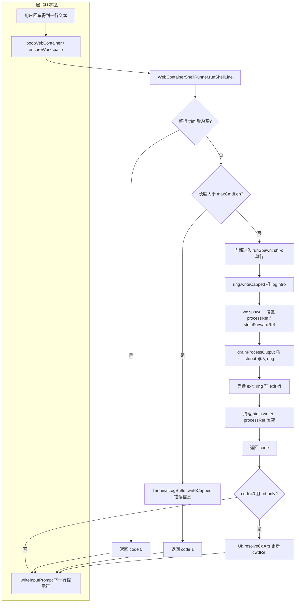
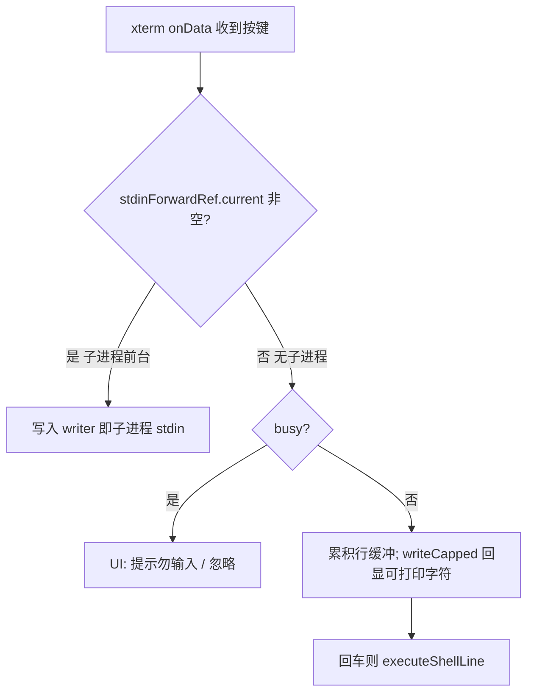
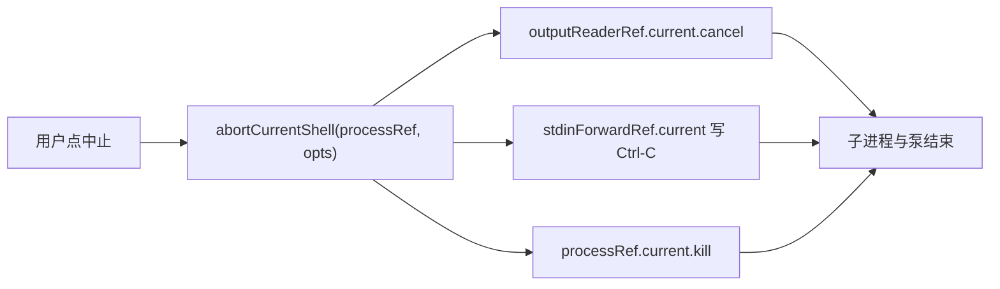

# WebContainer 演示 — 终端非 UI 逻辑迁移至 `core`

## 目标

将 `demos/webcontainer-openclaw` 中终端的**非 UI、与 xterm 组件无直接绑定**的可复用逻辑，从 `src/lib/features/terminal` 迁至 `src/lib/core/terminal`，与 `core/webcontainer/boot` 并列；`features/terminal` 仅保留 Svelte 组件与对 `core` 的调用。

## 边界 / 非目标

- 不改动终端产品行为：spawn、`cd` 会话 cwd、提示符、日志截断、中止与 PoC 流程与现有 spec《WebContainer-终端路径提示符与多会话》一致。
- 不把 xterm 的创建、`onData`、ResizeObserver、toast 等移入 `core`（仍属 UI/组件层）。
- `core` 内实现遵循仓库规则：**以 class 组织可复用过程**（配置加载、日志环、WebContainer 命令执行、路径/提示符解析），避免仅搬运为顶层函数堆。

## 抽象步骤：API 设计优先

抽离 `core` 时，**第一步不是搬文件，而是定 API 面**（谁 import、暴露哪些类型与入口、状态由谁持有、与 xterm/WebContainer 的边界在哪）。实现文件与类名是第二步，用来**兑现**已定契约。

本模块的约定是：

- **唯一稳定入口**：调用方只从 **`$lib/core/terminal`**（`index.ts` barrel）引用；**不**依赖 `core/terminal/config.ts` 等子路径（子路径视为内部实现，可重构）。
- **契约先于目录**：公开表（见下「API 一览」）一旦写在 spec 里，改名或删导出需走迁移说明；内部算法可自由替换。
- **类成员可见性与文档一致**：对外契约以 TypeScript 的 **`public` / `private`**（含 `private static`）为准；spec 中的 API 表与源码同步，避免「文档写公开、代码仍可从子路径偷用」的漂移。

## 为什么这样设计（原因简述）

| 决策 | 原因 |
|------|------|
| 逻辑进 `core/terminal`，UI 留在 `features/terminal` | `core` 与框架/UI 解耦，便于复用与测试；xterm 实例、焦点、toast 仍属组件职责。 |
| 用 **class**（`TerminalLogBuffer`、`*Ref`、`TerminalConfigLoader`、`WebContainerShellRunner`、`TerminalCwdPrompt`） | 符合仓库对 `core` 的约定；有状态（缓冲、进程引用）用实例持有，无状态工具用静态方法聚在一类，避免一文件堆满零散 function。 |
| `WebContainerShellRunner` 用 **静态方法**、长参数表 | 当前单一调用方（`TerminalPane`），无需再抽象「会话对象」；**状态**放在调用方持有的 `TerminalLogBuffer` 与 `*Ref` 上，runner 不长期占状态，便于看清数据流。 |
| `TerminalCwdPrompt` 以 **public static** 暴露规则入口，**private static** 隐藏拼接与归一化细节 | 调用方只依赖「提示符 / cd」语义，不依赖正则或路径栈实现。 |
| 单一 **barrel** 导出 | 明确公开面；子文件拆分只为维护性，不扩大对外承诺。 |

## API 一览（与源码 `public` / `private` 对齐）

**入口**：仅 `import … from "$lib/core/terminal"`。下表为 **稳定契约**；未列出的类成员或未从 `index.ts` 导出的符号视为内部。

对**调用方可见的**符号，除可见性外必须能回答：**做什么、输入输出、典型调用顺序**。内部成员仅标可见性，不展开功能（实现可换）。

### 模块级导出（类型与常量）

| 符号 | 类别 | 功能说明 |
|------|------|----------|
| `TerminalConfig` | `type` | 终端侧运行时配置形状：`logMaxBytes` / `logMaxLines` 控制内存中日志缓冲上限（超出则截断）；`maxCmdLen` 为单行命令最大字符数（超出则拒绝执行）；`truncateStrategy` 固定为 `drop-head`；`truncateMarker` 为截断时插入的提示串。通常由 `TerminalConfigLoader.load()` 得到，与根目录 `terminal.config.json` 合并默认值。 |
| `RunShellLineOptions` | `type` | `runShellLine` 的可选参数：`noCommandEcho` 为 true 时不往终端再打印一行 `$ cmd`（用于调用方已本地回显时）；`cwd` 为相对 WebContainer `workdir` 的路径，传给本次 `sh -c` 的 spawn。 |
| `SpawnExtraOptions` | `type` | `runSpawn` 的可选附加：`cwd` 同上，传给 `wc.spawn`；省略或空串表示使用默认 workdir。 |
| `DEFAULT_TERMINAL_CONFIG` | `const` | 内置默认配置对象；用于测试、或在与 JSON 合并时作为基线。正常运行路径仍以 `TerminalConfigLoader.load()` 为准。 |

### `TerminalConfigLoader`

| 成员 | TS 可见性 | 功能说明 |
|------|-----------|----------|
| `static load()` | `public` | 读取构建时绑定的 `terminal.config.json`，与 `DEFAULT_TERMINAL_CONFIG` 合并（并强制 `truncateStrategy`），返回完整 `TerminalConfig`。无 IO 运行时读取，仅打包时静态导入。 |

### `TerminalLogBuffer`

| 成员 | TS 可见性 | 功能说明 |
|------|-----------|----------|
| `buf` | `private` | 内部累积文本；**勿依赖**。 |
| `static applyLineCap` | `private static` | 行数截断辅助；**勿依赖**。 |
| `clear` | `public` | 清空内部缓冲并调用 `term.clear()`，用于整屏清屏（如 PoC 开始前）。 |
| `writeCapped` | `public` | 将 `chunk` 追加进缓冲，按 `cfg` 做**字节上限**与**行数上限**截断，必要时整屏重写；否则仅 `term.write(chunk)`。所有终端输出与 runner 写入应走**同一实例**，与会话日志一致。 |

### `WebContainerProcessRef` / `StdinForwardRef` / `OutputReaderRef`

三类句柄结构相同，语义不同；均需在**整个终端会话**内保持**同一实例**，由 UI 与 `WebContainerShellRunner` 共享。

| 类 | 成员 | TS 可见性 | 功能说明 |
|----|------|-----------|----------|
| `WebContainerProcessRef` | `current` | `public` | 当前前台 `WebContainerProcess`；运行中由 runner 赋值，结束后置 `null`；UI 可根据是否为 `null` 显示「是否有子进程」。 |
| `StdinForwardRef` | `current` | `public` | 当前子进程 stdin 的 `WritableStreamDefaultWriter`；有前台进程时，xterm `onData` 应把按键写入此处；无进程时为 `null`。 |
| `OutputReaderRef` | `current` | `public` | 当前正在 `drain` 的标准输出 reader；`abortCurrentShell` 会对其 `cancel`，避免泵悬挂。 |

### `TerminalCwdPrompt`

路径与提示符均相对于 WebContainer **`workdir`** 的 POSIX 语义；`cwdRel` 为空串表示在 workdir 根。

| 成员 | TS 可见性 | 功能说明 |
|------|-----------|----------|
| `normalizePosixRel` | `private static` | 内部路径归一化；**勿依赖**。 |
| `stripQuotes` | `private static` | 内部去引号；**勿依赖**。 |
| `joinSteps` | `private static` | 内部路径拼接；**勿依赖**。 |
| `isCdOnlyLine` | `public static` | 判断整行（已 trim）是否为**仅** `cd` 命令（可选参数），与 one-shot `sh -c` 约定一致；**复合命令**（如 `cd a && ls`）返回 false，不更新会话 cwd。 |
| `cdArgFromLine` | `public static` | 从上述 cd-only 行解析目标参数（无参视为 `~`）；供 `resolveCdArg` 使用。 |
| `resolveCdArg` | `public static` | 根据当前会话相对路径 `currentRel` 与 `cdArgFromLine` 结果，计算**新的**相对 `workdir` 的 POSIX 路径（含 `~`、`/`、`~/` 等规则）。 |
| `formatPromptLabel` | `public static` | 生成展示用路径标签：`~/工作区目录名` + 可选 `/子路径`（`workdir` 为 WC 绝对路径，`cwdRel` 为会话相对路径）。 |
| `formatPromptLine` | `public static` | 在 `formatPromptLabel` 末尾追加 ` $ `，用作可编辑提示行前缀。 |

### `WebContainerShellRunner`

前提：`wc` 已 `boot`，`term` 已 `open`；`ring` / `processRef` / `stdinForwardRef` 等为**同一会话**上的实例。

| 成员 | TS 可见性 | 功能说明 |
|------|-----------|----------|
| `abortCurrentShell` | `public static` | 中止前台 shell：取消输出 reader、向 stdin 发 `Ctrl-C`、再 `kill` 进程。可选传入 `stdinRef` / `outputReaderRef` 与 `processRef` 配合。 |
| `runSpawn` | `public static` | 执行 `wc.spawn(command, args, { terminal, cwd? })`：先 `writeCapped` 打印 `logIntro`，运行期间设置 `processRef` 与 `stdinForwardRef`，泵 stdout 到 `ring`，等待退出码并打印 `[exit code]`，在 `finally` 中清理 writer 与引用。返回进程 exit code。 |
| `runShellLine` | `public static` | 对单行用户输入：空行返回 code 0；超长按 `cfg.maxCmdLen` 拒绝；否则等价于 `sh -c` 单行，选项见 `RunShellLineOptions`。返回 `{ code }`。 |
| `termDims` | `private static` | 从 xterm 取 cols/rows 并设下限，供 spawn；**勿依赖**。 |
| `drainProcessOutput` | `private static` | 读 `ReadableStream<string>` 并逐块回调；**勿依赖**。 |

### 文件级内部（不导出、不视为契约）

| 内容 | 说明 |
|------|------|
| `shellRunner.ts` 中 `ProcessRefLike` | 仅用于 `abortCurrentShell` 参数类型，未从 barrel 导出 |
| `cwdPrompt.ts` 顶层 `CD_ONLY` | `cd` 行匹配正则，实现细节 |

### 仍由 UI / `features` 负责（本模块 API 之外）

| 内容 | 说明 |
|------|------|
| xterm 创建与销毁、`FitAddon`、`onData`、toast、`bootWebContainer` 时机、多标签显隐 | 非 `core/terminal` 契约 |

### 典型集成顺序（供调用方对照）

1. `cfg = TerminalConfigLoader.load()`；`ring = new TerminalLogBuffer()`；`processRef` / `stdinForwardRef` / `outputReaderRef` 各 `new` 一份。  
2. 首屏或换行前：`TerminalCwdPrompt.formatPromptLine(workdir, cwdRel)` + `ring.writeCapped(term, …)`。  
3. 用户回车：`WebContainerShellRunner.runShellLine(…)`；若 `code === 0` 且 `isCdOnlyLine(line)`，则 `cwdRel = resolveCdArg(cwdRel, cdArgFromLine(line))`。  
4. 长按中止：`abortCurrentShell(processRef, { stdinRef, outputReaderRef })`。  
5. 自定义命令链：用 `runSpawn` 直接跑 `npm`/`npx` 等，参数与 `SpawnExtraOptions` 同上。

### API 执行流程图

下图与上文「典型集成顺序」一致：**实线框**多为 `core/terminal` 内 API；**虚线或标注 UI** 为 `features`/宿主职责（本包不实现，但参与时序）。

#### 图 1 — 执行一行：`runShellLine` 主路径（至下一提示符前）



#### 图 2 — 时序：UI、`WebContainerShellRunner`、WebContainer、`TerminalLogBuffer`

```mermaid
sequenceDiagram
  participant U as UI
  participant R as WebContainerShellRunner
  participant W as WebContainer
  participant L as TerminalLogBuffer
  participant P as 子进程

  U->>R: runShellLine(wc, line, term, ring, ...)
  R->>L: writeCapped(term, logIntro, cfg)
  R->>W: spawn("sh", ["-c", line], { terminal, cwd? })
  W-->>R: process
  R->>P: 绑定 processRef; stdinForwardRef 指向 proc.input
  loop 标准输出
    P-->>R: chunk
    R->>L: writeCapped(term, chunk, cfg)
  end
  P-->>R: exit code
  R->>L: writeCapped(term, "[exit …]", cfg)
  R-->>U: { code }
  Note over U: 若需更新会话 cwd，在 UI 内调用 TerminalCwdPrompt（非 Runner 内）
```

#### 图 3 — 运行中键盘：`stdinForwardRef` 与行编辑（双分支）



#### 图 4 — 中止：`abortCurrentShell`



若将来需要对外暴露更多能力，应**先**在本节表格中增补功能说明，再改源码可见性与 `index.ts`。

## Research Findings

- 当前非 UI 代码位于：
  - `src/lib/features/terminal/terminal.ts`：配置、`LogRing`、截断写入、`runSpawn` / `runShellLine`、abort、输出泵。
  - `src/lib/features/terminal/terminalCwd.ts`：`cd` 行识别、cwd 归一化、提示符字符串。
- 唯一 TS 消费者：`TerminalPane.svelte`（`TerminalPanel` 仅引用组件）。
- `terminal.config.json` 位于 demo 根目录，需由 `core/terminal` 内模块以相对路径静态导入（深度与自 `features/terminal` 迁出后重新计算）。

## Plan

迁移的**执行顺序**已与上文「抽象步骤：API 设计优先」对齐：先定 barrel 与类职责，再落文件与替换调用方。

### 新增（`src/lib/core/terminal/`）

| 文件 | 职责 |
|------|------|
| `config.ts` | `TerminalConfig` 类型、默认值、`TerminalConfigLoader.load()` |
| `logBuffer.ts` | `TerminalLogBuffer`：环形缓冲与 `writeCapped` / `clear` |
| `refs.ts` | `WebContainerProcessRef`、`StdinForwardRef`、`OutputReaderRef`（实例持有 `current`） |
| `shellRunner.ts` | `WebContainerShellRunner`：`public static` 的 `abortCurrentShell` / `runSpawn` / `runShellLine`；`private static` 的 `termDims`、`drainProcessOutput` |
| `cwdPrompt.ts` | `TerminalCwdPrompt`：静态方法封装原 `terminalCwd` 的纯函数逻辑 |
| `index.ts` | 对外 re-export |

### 删除 / 替换

- 删除 `src/lib/features/terminal/terminal.ts`、`terminalCwd.ts`。
- `TerminalPane.svelte`：import 改为 `$lib/core/terminal`（或 `index` 路径），`LogRing` / `createLogRing` 改为 `TerminalLogBuffer` 实例；refs 改为 `new *Ref()` 类实例。

### 文档反写

- `demos/webcontainer-openclaw/README.md`：将「静态导入路径」从 `features/terminal/terminal.ts` 改为 `core/terminal`。

## File Changes（签名级）

- 新增：`demos/webcontainer-openclaw/src/lib/core/terminal/*.ts`（见上表）。
- 修改：`demos/webcontainer-openclaw/src/lib/features/terminal/components/TerminalPane.svelte`（import 与类型/实例替换）。
- 删除：`demos/webcontainer-openclaw/src/lib/features/terminal/terminal.ts`、`terminalCwd.ts`。
- 修改：`demos/webcontainer-openclaw/README.md`（一行路径说明）。

## Checklist

- [x] `core/terminal` 模块实现完成，无循环依赖（`core` 不引用 `features`）。
- [x] `TerminalPane` 仅引用 `core/terminal` + 既有 `boot` / UI。
- [x] `pnpm -C demos/webcontainer-openclaw build` 与 `pnpm -C demos/webcontainer-openclaw check` 通过。

## Validation

- `pnpm -C demos/webcontainer-openclaw build`：通过（tsc + vite build）。
- `pnpm -C demos/webcontainer-openclaw check`：通过（0 errors）。

## Change Log

- 2026-05-01：初版 spec（迁移前）。
- 2026-05-01：执行 — 落盘 `core/terminal`，删除 `features` 下 `terminal.ts` / `terminalCwd.ts`，更新 `TerminalPane` 与 README。
- 2026-05-01：补充 — 「API 设计优先」、设计理由、公开 API / 内部分界（barrel 唯一入口、子路径非契约）。
- 2026-05-01：API 表化 — 与源码 `public`/`private` 对齐；`TerminalLogBuffer.buf`、`WebContainerShellRunner.drainProcessOutput`/`termDims`、`TerminalCwdPrompt.normalizePosixRel` 等标为内部。
- 2026-05-01：公开 API 表补充**功能说明**（字段语义、行为、前置条件）及**典型集成顺序**。
- 2026-05-01：补充 **API 执行流程图**（`runShellLine` 主路径、时序图、键盘双分支、中止）。

## Open Questions

- 无。
